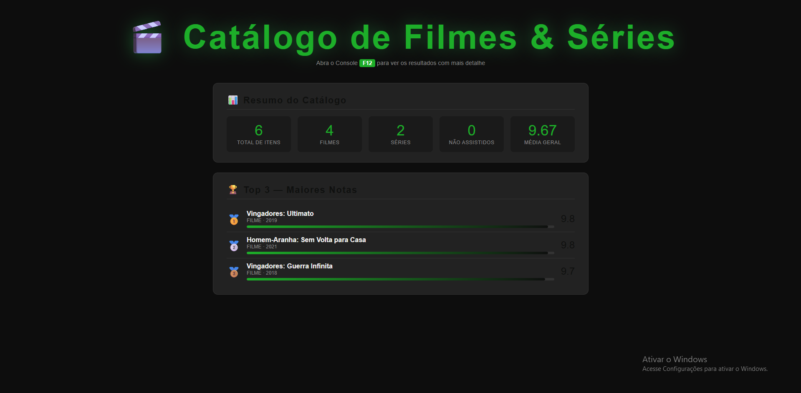
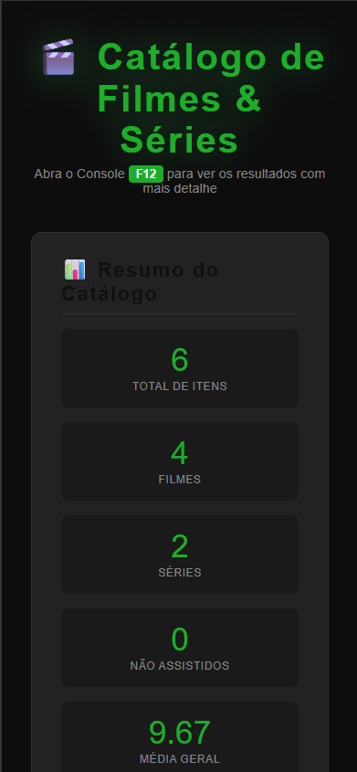

# Trabalho Prático - Semana 8

Nessa atividade, você vai trabalhar com um “mini catálogo” de itens (filmes ou séries) representados em JSON, e produzir algumas listagens e cálculos usando iterators.

**IMPORTANTE 1:** Você deve alterar apenas os arquivos **`README.md`**, **`index.html`** e **`styles.css`**, podendo incluir outros arquivos como imagens na pasta **`images`**, caso necessário. Deixe todos os demais arquivos e pastas desse repositório inalterados. **PRESTE MUITA ATENÇÃO NISSO.**

## Informações Gerais

- Nome: Gabriel Henrique de Souza Rodrigues
- Matricula: 913558
- Proposta de projeto escolhida: Catálogo de Filmes
- Breve descrição sobre seu projeto: Ter acesso de forma facíl a um catálogo de filmes com ranks

## Print da versão responsiva com Bootstrap [DESKTOP]

## Print da versão responsiva com Bootstrap [MOBILE] (*)

